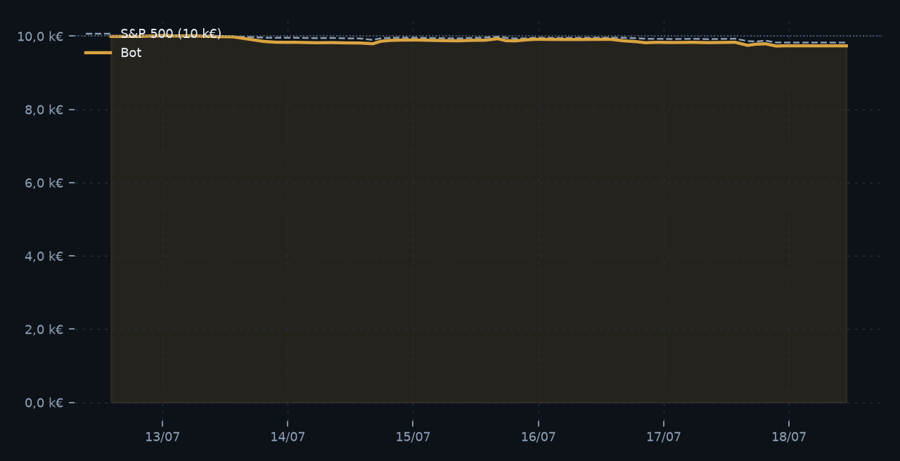

# 🧭 BOUSSOLE — bot 24h/24

**SIMULATION · cours réels · capital fictif** — mis à jour le 18/07/2026 à 11:00 (Paris) · sources : directes

## 🔴 9 733,81 €

**-266,19 € (-2,7 %)** · jour -0,0 % depuis le 12/07/2026

| Indicateur | Valeur | Indicateur | Valeur |
|---|---|---|---|
| Perf. annualisée | -81,3 % | Volatilité ann. | 13,8 % |
| Drawdown max | -2,7 % | Sharpe | -8,23 |
| Exposition | 97 % | Liquidités | 262,98 € |
| Trades clôturés | 16 (6 % gagnants) | Frais cumulés | 59,81 € |
| EUR/USD | 1,1446 | P&L réalisé | -239,42 € |

## Positions

| Actif | Qté | Cours | Valeur | P&L | Poids |
|---|---|---|---|---|---|
| **DBC** Panier mat. prem. | 96,208 | 28,98 $ | 2 435,87 € | -0,0 % | 25 % |
| **JPM** JPMorgan | 7,986 | 341,10 $ | 2 379,80 € | -1,3 % | 24 % |
| **QQQ** Nasdaq 100 | 3,459 | 695,33 $ | 2 101,13 € | -3,4 % | 22 % |
| **AAPL** Apple | 5,026 | 333,74 $ | 1 465,48 € | +5,5 % | 15 % |
| **USO** Pétrole WTI | 10,051 | 123,96 $ | 1 088,55 € | +0,1 % | 11 % |

## Signaux (classement momentum)

| # | Actif | Momentum | Tendance | Cible |
|---|---|---|---|---|
| 1 | **USO** Pétrole WTI | +40,5 % | ▲ | 11 % |
| 2 | **AAPL** Apple | +26,4 % | ▲ | 14 % |
| 3 | **DBC** Panier mat. prem. | +13,7 % | ▲ | 24 % |
| 4 | **JPM** JPMorgan | +10,1 % | ▲ | 25 % |
| 5 | **QQQ** Nasdaq 100 | +9,5 % | ▲ | 22 % |
| 6 | **SPY** S&P 500 | +6,0 % | ▲ | — |
| 7 | **NVDA** Nvidia | +4,5 % | ▲ | — |
| 8 | **EEM** Marchés émergents | +4,2 % | ▽ | — |

## Derniers ordres

| Date | Sens | Actif | Montant | P&L | Raison |
|---|---|---|---|---|---|
| 18/07 05:35 | ACHAT | **QQQ** | 441,85 € | — | Renforcement vers 22 % |
| 17/07 21:34 | VENTE | **NVDA** | 1 308,82 € | -11,50 € | Sorti du Top 5 |
| 17/07 21:34 | VENTE | **SPY** | 2 431,08 € | -29,90 € | Sorti du Top 5 |
| 17/07 21:34 | ACHAT | **DBC** | 2 434,00 € | — | Entrée momentum · rang 3 |
| 17/07 21:34 | ACHAT | **USO** | 1 086,23 € | — | Entrée momentum · rang 1 |
| 17/07 21:34 | ACHAT | **JPM** | 485,82 € | — | Renforcement vers 24 % |
| 17/07 05:42 | VENTE | **JPM** | 420,54 € | -4,85 € | Allègement vers 19 % |
| 16/07 20:33 | VENTE | **QQQ** | 453,43 € | -12,88 € | Allègement vers 17 % |
| 16/07 20:33 | VENTE | **DBC** | 2 453,38 € | -24,55 € | Filtre de tendance (< MM100) |
| 16/07 20:33 | ACHAT | **SPY** | 2 456,09 € | — | Entrée momentum · rang 4 |
| 16/07 05:40 | VENTE | **GOOGL** | 1 686,71 € | -2,85 € | Sorti du Top 5 |
| 16/07 05:40 | ACHAT | **JPM** | 2 345,39 € | — | Entrée momentum · rang 3 |

## Journal

- `18/07 05:35` — 1 ordre exécuté
- `17/07 21:34` — 5 ordres exécutés
- `17/07 13:42` — Portefeuille déjà aligné — aucun ordre
- `17/07 05:42` — 1 ordre exécuté
- `16/07 20:33` — 3 ordres exécutés
- `16/07 13:55` — Portefeuille déjà aligné — aucun ordre

---
_Stratégie : momentum 3 & 6 mois, filtre MM100, Top 5 pondéré inverse-volatilité (max 25 %/ligne), bande 4 %, frais 0,10 %/ordre (min 1 €), arbitrage au plus toutes les 6 h. Passage horaire via GitHub Actions._

_Outil pédagogique : aucun argent réel, aucune garantie de performance, pas un conseil en investissement._