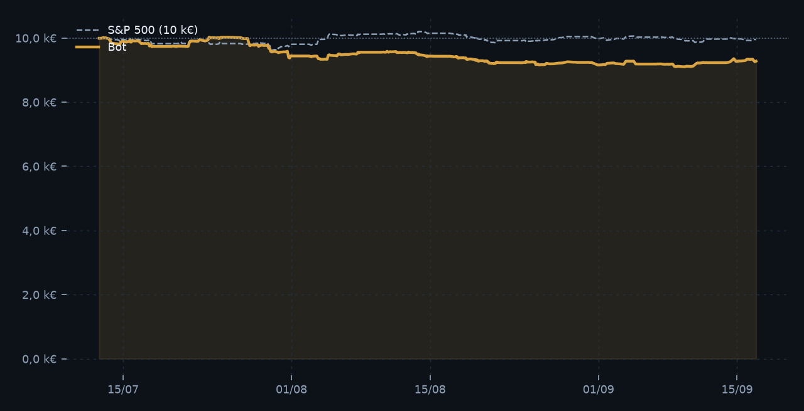

# 🧭 BOUSSOLE — bot 24h/24

**SIMULATION · cours réels · capital fictif** — mis à jour le 12/08/2026 à 08:44 (Paris) · sources : directes

## 🔴 9 549,07 €

**-450,93 € (-4,5 %)** · jour +0,0 % depuis le 12/07/2026

| Indicateur | Valeur | Indicateur | Valeur |
|---|---|---|---|
| Perf. annualisée | -42,1 % | Volatilité ann. | 13,4 % |
| Drawdown max | -6,9 % | Sharpe | -2,75 |
| Exposition | 83 % | Liquidités | 1 616,66 € |
| Trades clôturés | 44 (27 % gagnants) | Frais cumulés | 153,83 € |
| EUR/USD | 1,1539 | P&L réalisé | -632,52 € |

## Positions

| Actif | Qté | Cours | Valeur | P&L | Poids |
|---|---|---|---|---|---|
| **JPM** JPMorgan | 7,713 | 362,04 $ | 2 420,05 € | +3,0 % | 25 % |
| **QQQ** Nasdaq 100 | 3,837 | 718,45 $ | 2 388,71 € | -0,0 % | 25 % |
| **MSFT** Microsoft | 2,492 | 503,81 $ | 1 088,00 € | +11,3 % | 11 % |
| **USO** Pétrole WTI | 9,355 | 127,61 $ | 1 034,56 € | +0,3 % | 11 % |
| **AMZN** Amazon | 4,243 | 272,27 $ | 1 001,07 € | -0,2 % | 10 % |

## Signaux (classement momentum)

| # | Actif | Momentum | Tendance | Cible |
|---|---|---|---|---|
| 1 | **USO** Pétrole WTI | +26,0 % | ▲ | 10 % |
| 2 | **MSFT** Microsoft | +22,7 % | ▲ | 11 % |
| 3 | **AMZN** Amazon | +17,0 % | ▲ | 11 % |
| 4 | **JPM** JPMorgan | +16,2 % | ▲ | 25 % |
| 5 | **QQQ** Nasdaq 100 | +9,5 % | ▲ | 25 % |
| 6 | **DBC** Panier mat. prem. | +9,4 % | ▲ | — |
| 7 | **SPY** S&P 500 | +7,9 % | ▲ | — |
| 8 | **AAPL** Apple | +7,4 % | ▲ | — |

## Derniers ordres

| Date | Sens | Actif | Montant | P&L | Raison |
|---|---|---|---|---|---|
| 12/08 02:01 | VENTE | **DBC** | 2 413,24 € | +15,58 € | Sorti du Top 5 |
| 12/08 02:01 | ACHAT | **QQQ** | 2 387,27 € | — | Entrée momentum · rang 5 |
| 11/08 19:14 | VENTE | **QQQ** | 2 336,59 € | -15,75 € | Sorti du Top 5 |
| 11/08 19:14 | ACHAT | **USO** | 1 030,55 € | — | Entrée momentum · rang 1 |
| 11/08 00:00 | VENTE | **NVDA** | 1 469,39 € | +37,97 € | Sorti du Top 5 |
| 11/08 00:00 | ACHAT | **QQQ** | 2 347,65 € | — | Entrée momentum · rang 5 |
| 10/08 17:18 | VENTE | **QQQ** | 2 399,98 € | +54,89 € | Sorti du Top 5 |
| 10/08 17:18 | ACHAT | **DBC** | 2 392,86 € | — | Entrée momentum · rang 4 |
| 07/08 02:17 | VENTE | **AAPL** | 1 763,85 € | -79,51 € | Sorti du Top 5 |
| 07/08 02:17 | ACHAT | **AMZN** | 1 002,25 € | — | Entrée momentum · rang 4 |
| 04/08 20:04 | VENTE | **AMZN** | 971,92 € | -24,36 € | Sorti du Top 5 |
| 04/08 20:04 | ACHAT | **NVDA** | 1 428,52 € | — | Entrée momentum · rang 5 |

## Journal

- `12/08 08:44` — Portefeuille déjà aligné — aucun ordre
- `12/08 02:01` — 2 ordres exécutés
- `11/08 19:14` — 2 ordres exécutés
- `11/08 13:07` — Portefeuille déjà aligné — aucun ordre
- `11/08 06:41` — Portefeuille déjà aligné — aucun ordre
- `11/08 00:00` — 2 ordres exécutés

---
_Stratégie : momentum 3 & 6 mois, filtre MM100, Top 5 pondéré inverse-volatilité (max 25 %/ligne), bande 4 %, frais 0,10 %/ordre (min 1 €), arbitrage au plus toutes les 6 h. Passage horaire via GitHub Actions._

_Outil pédagogique : aucun argent réel, aucune garantie de performance, pas un conseil en investissement._