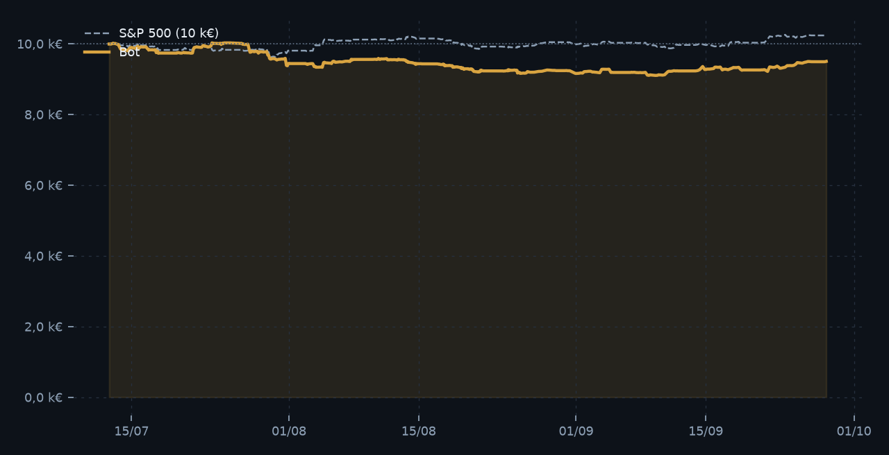

# 🧭 BOUSSOLE — bot 24h/24

**SIMULATION · cours réels · capital fictif** — mis à jour le 06/10/2026 à 23:41 (Paris) · sources : directes

## 🔴 9 665,34 €

**-334,66 € (-3,3 %)** · jour -0,1 % depuis le 12/07/2026

| Indicateur | Valeur | Indicateur | Valeur |
|---|---|---|---|
| Perf. annualisée | -13,4 % | Volatilité ann. | 10,8 % |
| Drawdown max | -9,0 % | Sharpe | -0,88 |
| Exposition | 100 % | Liquidités | 1,00 € |
| Trades clôturés | 93 (30 % gagnants) | Frais cumulés | 320,03 € |
| EUR/USD | 1,1264 | P&L réalisé | -816,63 € |

## Positions

| Actif | Qté | Cours | Valeur | P&L | Poids |
|---|---|---|---|---|---|
| **AAPL** Apple | 8,112 | 333,63 $ | 2 402,80 € | +0,8 % | 25 % |
| **MSFT** Microsoft | 4,876 | 529,30 $ | 2 291,17 € | +14,8 % | 24 % |
| **QQQ** Nasdaq 100 | 3,391 | 759,66 $ | 2 287,07 € | +0,2 % | 24 % |
| **NVDA** Nvidia | 8,193 | 239,24 $ | 1 740,06 € | +7,0 % | 18 % |
| **META** Meta | 1,438 | 738,88 $ | 943,24 € | +5,5 % | 10 % |

## Signaux (classement momentum)

| # | Actif | Momentum | Tendance | Cible |
|---|---|---|---|---|
| 1 | **MSFT** Microsoft | +40,1 % | ▲ | 21 % |
| 2 | **NVDA** Nvidia | +25,8 % | ▲ | 18 % |
| 3 | **META** Meta | +25,5 % | ▲ | 8 % |
| 4 | **AAPL** Apple | +19,0 % | ▲ | 21 % |
| 5 | **QQQ** Nasdaq 100 | +17,9 % | ▲ | 25 % |
| 6 | **USO** Pétrole WTI | +17,0 % | ▲ | — |
| 7 | **DBC** Panier mat. prem. | +14,4 % | ▲ | — |
| 8 | **AMZN** Amazon | +12,5 % | ▲ | — |

## Derniers ordres

| Date | Sens | Actif | Montant | P&L | Raison |
|---|---|---|---|---|---|
| 06/10 12:23 | VENTE | **USO** | 1 070,01 € | +135,47 € | Sorti du Top 5 |
| 06/10 12:23 | VENTE | **NVDA** | 608,61 € | +38,63 € | Allègement vers 18 % |
| 06/10 12:23 | ACHAT | **QQQ** | 2 279,69 € | — | Entrée momentum · rang 5 |
| 02/10 07:43 | VENTE | **DBC** | 2 385,94 € | -9,03 € | Sorti du Top 5 |
| 02/10 07:43 | ACHAT | **AAPL** | 2 381,08 € | — | Entrée momentum · rang 5 |
| 01/10 21:34 | VENTE | **AAPL** | 2 173,95 € | +66,59 € | Sorti du Top 5 |
| 01/10 21:34 | ACHAT | **DBC** | 2 390,19 € | — | Entrée momentum · rang 5 |
| 01/10 08:01 | ACHAT | **NVDA** | 485,70 € | — | Renforcement vers 24 % |
| 30/09 02:30 | VENTE | **QQQ** | 1 314,14 € | -1,27 € | Sorti du Top 5 |
| 29/09 17:55 | ACHAT | **QQQ** | 1 312,79 € | — | Entrée momentum · rang 5 |
| 25/09 03:33 | VENTE | **DBC** | 2 372,61 € | +0,56 € | Sorti du Top 5 |
| 25/09 03:33 | ACHAT | **NVDA** | 1 707,16 € | — | Entrée momentum · rang 5 |

## Journal

- `06/10 19:13` — Portefeuille déjà aligné — aucun ordre
- `06/10 12:23` — 3 ordres exécutés
- `06/10 00:41` — Portefeuille déjà aligné — aucun ordre
- `05/10 18:04` — Portefeuille déjà aligné — aucun ordre
- `05/10 09:06` — Portefeuille déjà aligné — aucun ordre
- `04/10 23:31` — Portefeuille déjà aligné — aucun ordre

---
_Stratégie : momentum 3 & 6 mois, filtre MM100, Top 5 pondéré inverse-volatilité (max 25 %/ligne), bande 4 %, frais 0,10 %/ordre (min 1 €), arbitrage au plus toutes les 6 h. Passage horaire via GitHub Actions._

_Outil pédagogique : aucun argent réel, aucune garantie de performance, pas un conseil en investissement._